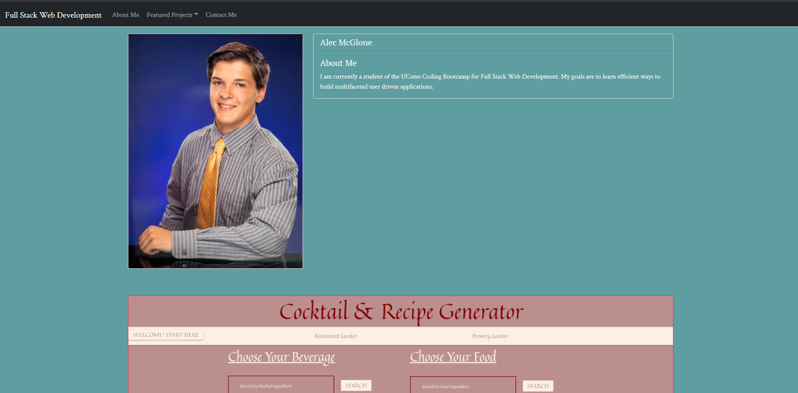
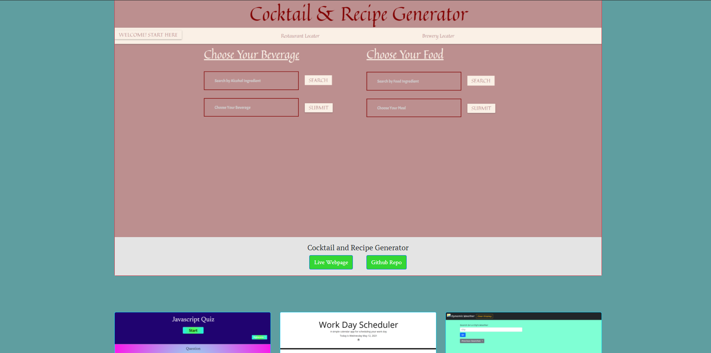
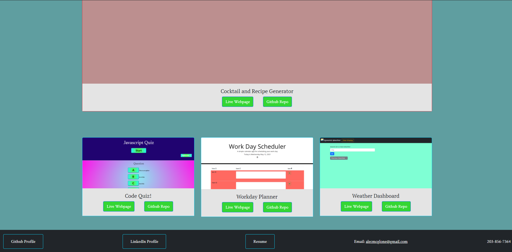

# Updated Portfolio

For this project I rebuilt my portfolio adding completed projects as the showcased developments.

The objectives to complete this Project include the following:

When loading the webpage the user is presented...
* My full name, email, phone number, and a short statement
* Links to GitHub profile and LinkedIn profile 
* Link to downloadable pdf of resume
* A showcase project stands out from the others
* 2-3 more projects are displayed
* A polished mobile-first user interface

# Intro

# Middle

# Footer

View Live Webpage!
https://alec74.github.io/weatherDashboard/